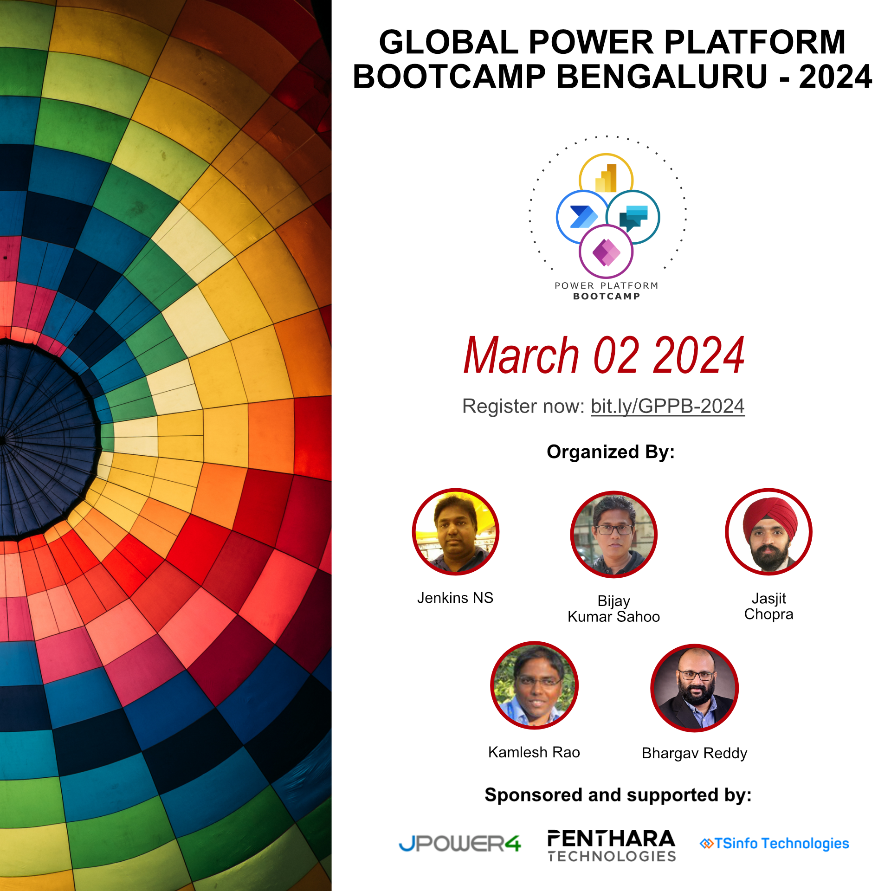
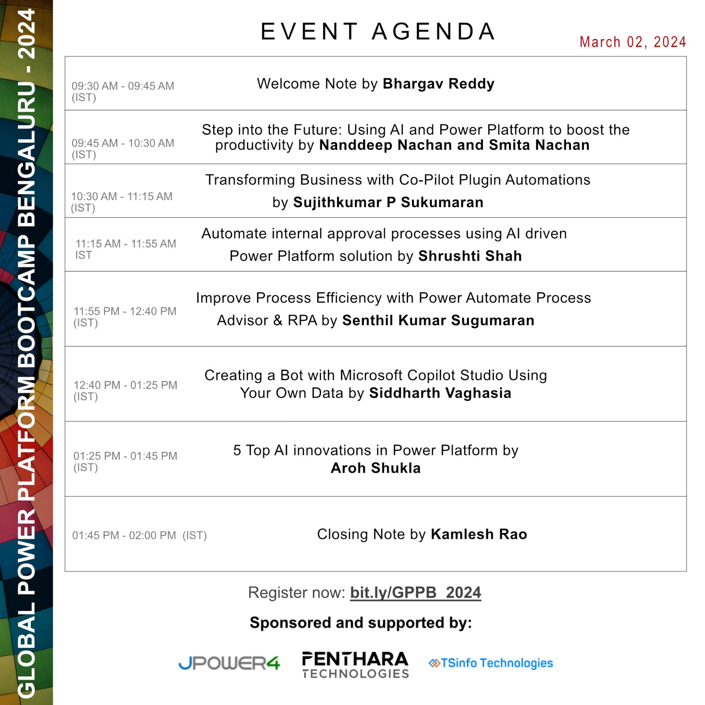

# Global Power Platform Bootcamp 2024 (Bengaluru)
### 02-Mar-2024 (Virtual Event)

Thanks to all the attendees of Global Power Platform Bootcamp 2024 (Bengaluru).  Here, we are sharing the Presentation links from all Speakers. Reach out to us on Twitter [@m365blr](https://twitter.com/m365blr "Microsoft 365 Bangalore") for any further inputs (Hash tag #M365BLR).

### [Global Power Platform Bootcamp Website](https://www.powerplatformbootcamp.com/)

## Organizers

## Agenda

## Session Presentations

| Sl# | Speaker Name | Session Title | Presentation / Links | Recording Link |
|:---:|:------|:-----------|:---------|:------------|
| 1 | Nanddeep Nachan / Smita Nachan | Step into the Future: Using AI and Power Platform to boost the productivity | <a href="https://www.slideshare.net/secret/ygwSvOwrixsRwn" target="_blank" title="Nanddeep's Personal SlideShare">SlideShare</a>  | [YouTube](https://www.youtube.com/watch?v=pvmEEDGZMwI "") |
| 2 | Sujithkumar P Sukumaran | Transforming Business with Co-Pilot Plugin Automations  | [Presentation](./slide-decks/GPPB-2024-BLR-Transforming_Business_with_Co-Pilot_Plugin_Automations.pdf "") |  [YouTube](https://www.youtube.com/watch?v=WUrxM1GY8rY "") |
| 3 | Shrushti Shah | Automate internal approval processes using AI driven | [Presentation](http://bing.com "") |  [YouTube](https://www.youtube.com/watch?v=bT8R8cUWgdo "") |
| 4 | Senthil Kumar Sugumaran | Improve Process Efficiency with Power Automate Process | [Presentation](./slide-decks/GPPB-2024-Improve_Process_Efficiency_with_Power_Automate_Process.pdf "") |  [YouTube](https://www.youtube.com/watch?v=i-i1aWN3mSc "")
| 5 | Siddharth Vaghasia | Creating a Bot with Microsoft Copilot Studio Using Your Data | [Presentation](./slide-decks/GPPB-2024-BLR-Creating_a_Bot_with_Microsoft_Copilot_Studio_Using_Your_Data.pdf "") |  [YouTube](https://www.youtube.com/watch?v=l_nXkQG6AcY "")
| 6 | Aroh Shukla | 5 Top AI innovations in Power Platform | [Presentation](./slide-decks/GPPB-2024-BLR-5_Top_AI_innovations_in_Power_Platform.pdf "") |  [YouTube](https://www.youtube.com/watch?v=s4LBeW2Mv5g "")

## Microsoft User Groups in Bangalore
These are links to Microsoft Technology related User Groups that runs in-person / online meetups.
* Microsoft 365 Bangalore | [Facebook](https://www.facebook.com/groups/m365blr/ "Facebook") | [Twitter](https://twitter.com/m365blr "Twitter")

* Microsoft Azure User Group Bangalore | [Meetup](https://www.meetup.com/Microsoft-Azure-Bangalore/  "Meetup")

* Bangalore .NET User Group | [Facebook](https://www.facebook.com/groups/BDotNet/  "Facebook")

* Bangalore IT Pro + PowerShell User Group | [Facebook](https://www.facebook.com/groups/psbug/ "Facebook")

* aOS Community | [Facebook](https://www.facebook.com/aosComm/ "Facebook")

* SQL Bangalore | [Facebook](https://www.facebook.com/groups/SQLBangalore/   "Facebook")

* DataPlatformGeeks | [Website](http://www.dataplatformgeeks.com/ "Website")

* C# Corner Bengaluru Chapter | [Website](https://www.c-sharpcorner.com/chapters/bengaluru-chapter "C# Corner Bengaluru Chapter")
